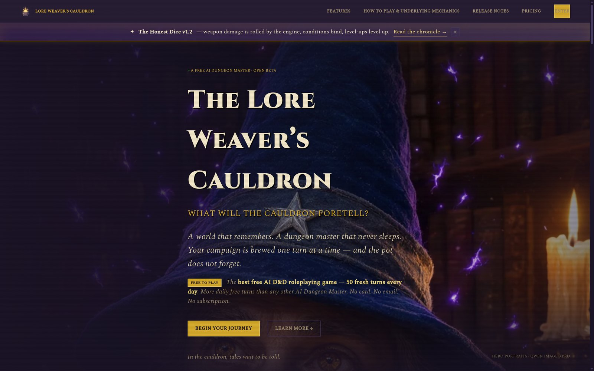
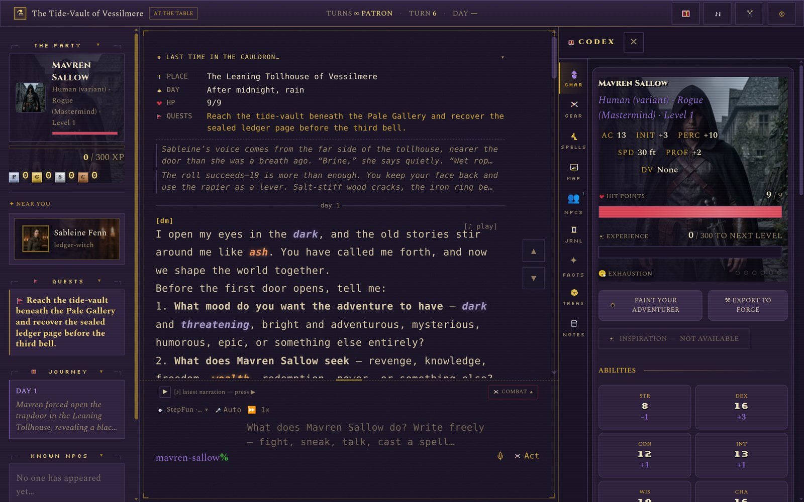
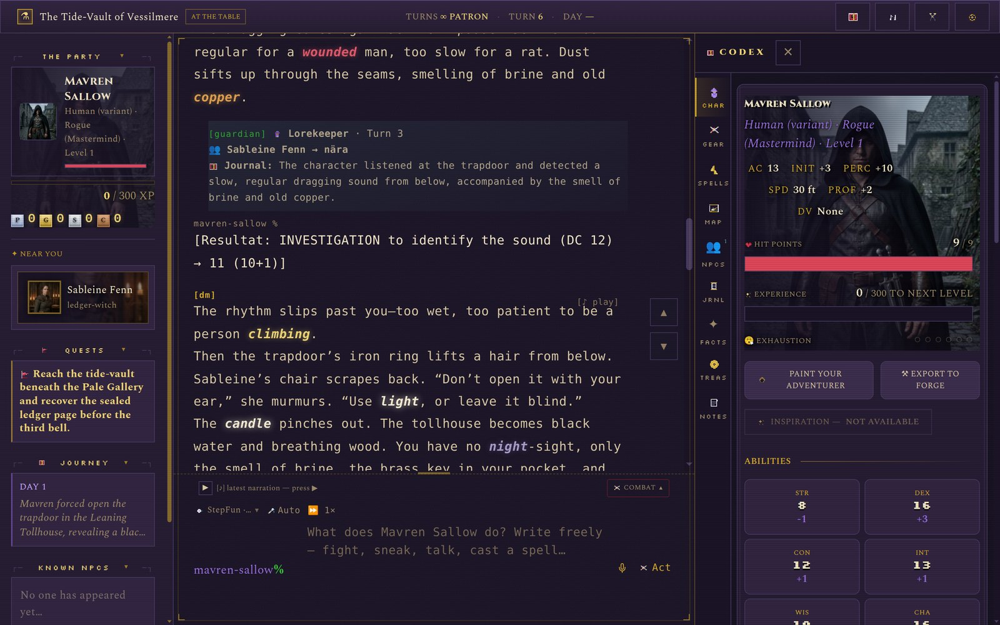
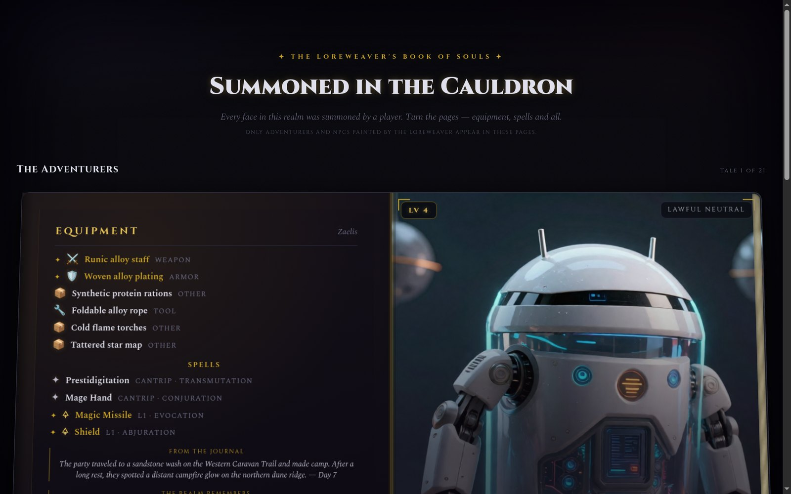
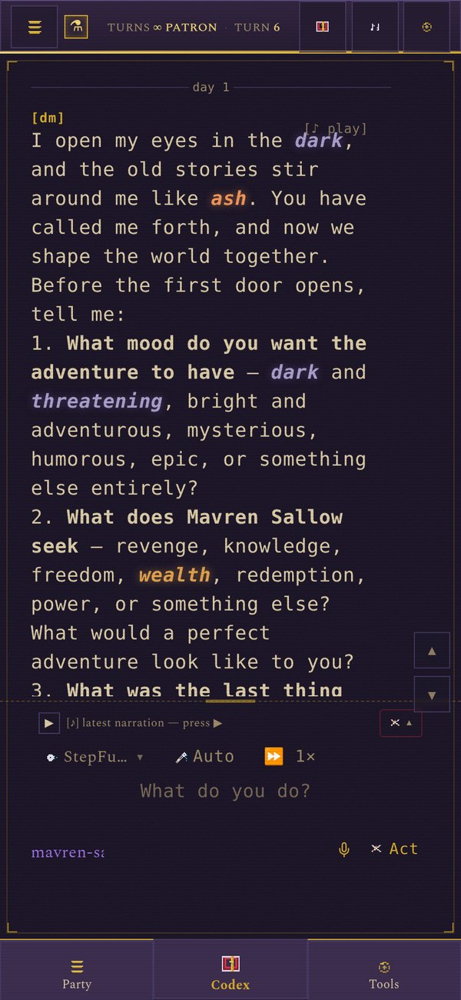

# 🐉 The Lore Weaver's Cauldron

> A conversational D&D 5e game where a large language model is your Dungeon Master.
> Speak, roll, fight, and explore a dark fantasy world that remembers everything you do.

**Status:** 🔧 Pre-1.0 · active development · **License:** MIT · **Stack:** Python 3.11 / FastAPI · Vanilla JS (no build step)

## 🎮 Play now

> **Live game: [dnd.rostad.cc](https://dnd.rostad.cc)** — free to play, open beta, no card and no email required to start.
>
> Free players get **30 turns a day** (refreshed at midnight) with **step-3.7-flash** and **step-3.5-flash-2603**. The one-time **10€ unlock** adds **+100 turns** (never expire, spent after the daily free turns) and opens every Dungeon Master, voice narration (Qwen/StepFun TTS) and image generation (StepFun / Wan 2.7 Pro / Qwen Image 3 Pro) — permanently. Donations: **1€ = 100 turns**. Full pricing on the live site.

The Lore Weaver's Cauldron is a single-player, browser-based D&D 5e campaign engine. Instead of a rulebook and a dice tower, you get a living table: an LLM weaves the narration, plays every NPC, and reacts to whatever you type — while a dedicated *Guardian* module silently handles all the mechanics (dice, damage, XP, items, gold, quests) so the story never has to stop for bookkeeping.

The game speaks **Svenska and English** (campaign-aware, chosen when you start a campaign), carries a retro terminal aesthetic, and keeps a persistent memory of your adventures — facts, NPCs, places, and quests survive across sessions.

---

## 📸 At the table

The cauldron gate — every hero portrait on the site is painted in-game by Qwen Image 3 Pro:



The game table: DM narration on the left, live character sheet in the Codex drawer, party/quest/NPC state in the sidebar:



Rolls are resolved server-side and shown inline — skill, DC, total and dice breakdown, failures included:



The Book of Souls — a gallery of adventurers and NPCs, painted and tracked from the live campaign state:



Built for the phone too — full table, terminal composer and voice input in a portrait layout:



---

## ✨ Features

### 🗣️ Conversational Dungeon Master
- Full LLM-driven DM that narrates scenes, plays NPCs with colored names, and reacts to free-form input
- **`@NPC` direct chat** — address any known NPC by name and the DM role-plays them with their own context (personality, relation, memories)
- **Streamed narration** — tokens appear as the DM "speaks"
- **Undo the last turn** — rewind the newest turn: your message, the DM's reply and everything the Lorekeeper recorded from it (HP, gold, items, quests, journal) returns to where it stood; costs one turn, single-level
- **Admin-only diagnostics** — model/token/latency footers and the DM's raw reasoning monologue render exclusively for admin accounts; players never see engine internals or prompt text

### 🎲 Dice & Combat
- **Server-authoritative dice** (`NdX±M` notation, Python `secrets`): every check, attack and weapon damage rolls on the server — a client-side fallback is always visibly marked as an *offline roll*, never passed off as trusted
- **Advantage/disadvantage done honestly**: the server rolls 2d20 and the UI shows both dice, the chosen one highlighted gold, the dropped one dimmed — no faked duplicate rolls
- **Chat-first combat (v26+)**: the DM narrates every swing; the Guardian extracts mechanics and runs the round bookkeeping — a round auto-advances once the player and *every living enemy* have acted (per-enemy index keys, so identically named enemies can't share an action flag), conditions tick between rounds, and each turn ends with exactly one true-HP snapshot instead of duplicated stale lines
- Dramatic d20 ceremony in chat — gold flash on a natural 20, blood on a natural 1; initiative order, action economy (action / bonus action / reaction), allies, and flee attempts
- Combat end zeroes defeated enemies (`falls!` trail or explicit defeat list) and records how many were still standing when the fight closed

### 🧙 Character Creation
- Pick from a roster of **hand-crafted archetypes** (the Fallen Knight, the Ash Witch, the Hunter, the Void Scribe…) or write your own prompt
- The LLM weaves a full **character sheet** (stats, HP, AC, saves, traits, equipment, backstory) as JSON per `state-schema.json`
- **Character vault** — save characters, inspect them, generate avatars, load them into any campaign
- Templates are fully bilingual (SV/EN)

### 🏰 World, NPCs & Memory
- **NPC codex** — a living registry of every NPC: colors, icons, conversations, meeting places, quests, trade, and trust
- **Facts register** — structured, deduplicated, versioned lore extracted from every DM reply (categories: npc, location, item, event, promise, world, relationship), injected back into the DM's context
- **Quest tracker**, **logbook** (an LLM-written day-by-day adventure journal), **pin notes**, and **lore entries**
- **Campaign usage panel** — token spend per player and per model, turn counts, TTS minutes

### 🗺️ Places & Travel
- Dynamic, seeded map with **fog of war**, quest markers, and a glowing "current location"
- Realistic **travel times** by terrain (`väg 0.5 · stig 0.8 · slätt 0.6 · hav 0.4 · skog 1.2 · berg 1.8 · träsk 1.5 · is 1.4 · okänd 1.0`; travel time = distance ÷ 10 × modifier)
- Places are placed deterministically from the campaign seed — the same place always lands on the same spot

### 🧠 RAG Memory (retrieval-augmented generation)
- Every transcript is chunked, embedded (**nomic-embed-text**, 768-dim, via local Ollama) and indexed into **Qdrant** (collection `loreweavers_cauldron`)
- Before each turn, relevant memories are retrieved and injected into the DM's system prompt — the world truly remembers
- Deterministic content-hash IDs prevent duplicate indexing

### 🏮 Local AI — Bring Your Own Breath (Ollama relay)
- **The player's own Ollama can BE the DM — and the Lorekeeper and the Background too** — opt-in ("Use own Ollama"), never probed silently: the browser discovers a local Ollama only after you enable it, lists your installed models, and the turn's hops run on your hardware via a **prepare → stream → commit relay hop chain**
- **Server is the brain, your machine is the mouth**: `POST /api/chat/local/prepare` builds the DM prompt server-side (RAG memories, facts, state — never sent to your box beyond the prompt) and hands the client an Ollama payload; the client streams from `http://127.0.0.1:11434/api/chat` (base URL lives **only** in browser localStorage — the server never sees a user-supplied URL, so there is zero SSRF surface); `POST /api/chat/local/commit` runs the full post-processing (Guardian extraction, facts, RAG) exactly like a house turn
- **Per-role local models — no mode switch**: `local:*` models can be picked for the **Dungeon Master**, the **Lorekeeper** (`meta.guardian_model`) and/or the **Background** (`meta.extraction_model`) in the campaign model dropdowns (🏮 group in settings and new-adventure onboarding); which hops run locally is derived per turn from the campaign's role models. A local background role requires a `local:*` DM (the relay only exists on the local-DM path); campaigns still carrying the removed `local_pipeline="full"` setting keep behaving the same via a legacy shim (both roles carved, running on the DM's local model)
- **`local:<model>` model IDs** (e.g. `local:qwen3:14b`) — the backend hard-refuses to call a `local:` prefix server-side (defence-in-depth); hops needing JSON run with `format` at the payload top level and `think:false` (real Ollama 0.15 semantics)
- **Honest economics**: relay turns do **not** consume your house turn pool; instead a `local_dm` ledger row (0 turns) is recorded for admin visibility, capped daily (`LOCAL_DM_DAILY_CAP`, default 100; `LOCAL_DM_DAILY_CAP_FULL`, default 300 — the higher cap applies when both Lorekeeper and Background run locally and the house pays ~nothing per turn)
- **num_ctx is explicit** (8192 / 16384 / 32768 picker, default 16384 — Ollama's stock 4k context is not enough for a campaign prompt), steps are single-use, TTL-bounded (default 600 s) and locked to `(user, campaign, turn_count)` — a 409 drift re-runs the whole turn through the relay
- **The one gotcha is CORS**: a browser may not read a local Ollama from another origin. The picker detects it and shows the exact fix — `OLLAMA_ORIGINS=https://dnd.rostad.cc ollama serve` — plus the full player guide at **`local-ai.html`** (how it works, tray/CORS trap, verification, FAQ)
- **Opt-in feature flag server-side**: `LOCAL_AI_ENABLED=1` (default `0` → endpoints return 503). Nothing local ever touches API keys — house model keys stay on the server as always

### 🔮 Models & Voice
- **Multi-provider model router**: Qwen (DashScope / Alibaba Token Plan), DeepSeek and StepFun models — switch the DM's brain per campaign, mid-game — plus `local:*` Ollama models (see above)
- **TTS narration**: StepFun voices (always free) or Qwen TTS — male/female narrator voices, per-campaign settings, style phrases
- Keys never leave the server — the frontend only ever sees model IDs

### 🖼️ Avatars & Portrait Art
- **AI-painted portraits** for your adventurer, the DM and every NPC — built from the live character sheet/NPC lore, with a gallery per subject (up to 5 paintings, arrow-key rotation)
- **Server-side thumbnails** (`?w=64/128/256/512`, PyMuPDF scaling, disk-cached and auto-regenerated) so a 52 px sidebar tile never ships a 1.2 MB original
- **Photoreal portraits render smooth** — the retro `image-rendering: pixelated` treatment is reserved for pixel sprites, not painted faces
- The DM gets its own d20 sigil until you paint it a portrait — it never borrows the player's face

### 🧭 Player-facing rules
- `mechanics.html` is the honest rulebook: engine behaviors (dice, spell slots & rests, TTS cache, undo) documented section by section and audited against the code, not against wishes

### 💳 Billing & Admin
- **Stripe one-time purchases** (2026-09-27): free tier (30 turns/day, step-3.7-flash + step-3.5-flash-2603), **unlock10** (10€ — +100 turns, all models + TTS + image generation, permanent), **donation** (any amount — 100 turns per €). Legacy: tier1/tier2 subscriptions and lifetime (100€) are honored until they expire
- Password reset flow via mail bridge
- **Admin dashboard** with SVG charts: token spend, players by country, role split, TTS minutes; per-user controls (turn caps, top-ups, resets, subscriptions)
- **IP geolocation** of players (private/LAN IPs are never sent anywhere) to flag abuse
- **Feedback inbox** and a full **billing ledger** (MRR, transactions per user)

### 📦 Import · Export · i18n
- **World import** — upload `.md`, `.pdf`, or images and Qwen extracts characters, NPCs, and places
- **Campaign export** as a structured archive (transcript, character sheets, attachments) + save/load slots
- **Bilingual UI** (SV/EN) with theme and sound settings; retro `snes.css` terminal theme, custom fonts and sprites
- Backend serves the frontend statically — **no frontend build step**, cache-busting via `?v=` params

---

## 🏗️ Architecture

The core idea: **the DM tells the story, the Guardian owns the mechanics, and the Extraction layer remembers.** One turn looks like this:

```
  Player message
       │
       ▼
┌───────────────────────────────────────────────┐
│  GUARDIAN — pre-DM check (guardian_check_roll) │  ◀─ is a dice roll needed?
└───────────────────┬───────────────────────────┘     (returns a roll request
                    │                                 BEFORE the DM narrates)
                    ▼
┌───────────────────────────────────────────────┐
│  DM — LLM narration (streamed)                │  ◀─ RAG memories + relevant
│  qwen3.8-max · deepseek ·                     │     facts injected into the
│  step-5-preview · step-3.7-flash              │     system prompt
└──────┬──────────────────────┬─────────────────┘
       │                      │
       ▼                      ▼
┌────────────────────────────────┐
│  GUARDIAN — post-DM extraction  │  ◀─ [SKADA:12] damage,
│  → state.json (single source    │     [GULD:15] gold,
└───────────────┬────────────────┘     [XP:], [FÖREMÅL:] items,
                ▼                     [PLATS:namn] places
┌───────────────────────────────────────────────┐
│  EXTRACTION — facts → FactRegister            │  ◀─ npc · location · item ·
│  (deduplicated + versioned, injected next     │     event · promise · world ·
│   turn so the DM never contradicts itself)    │     relationship
└───────────────────────┬───────────────────────┘
                        ▼
┌───────────────────────────────────────────────┐
│  RAG — transcript chunked + embedded          │  ◀─ nomic-embed-text (768-dim)
│  → Qdrant collection "loreweavers_cauldron"   │     via local Ollama
└───────────────────────────────────────────────┘

  Combat runs alongside: chat-first — the DM narrates, the Guardian
  extracts attacks and runs the round bookkeeping; combat.py owns
  the server dice, status ticking and initiative helpers.

  🏮 Local relay: any LLM hop above can optionally run on the PLAYER's
  machine instead — /api/chat/local/prepare builds the prompt server-side,
  the browser streams it through its own Ollama, /api/chat/local/commit
  finishes the turn. When the campaign's Lorekeeper/Background roles are
  local:* models too (and the DM is local), those hops run locally as a
  client hop chain; house keys and state never leave home.
```

| Module | Role |
|---|---|
| `backend/main.py` | FastAPI app — all routes, auth & tiers, DM prompt construction, streaming |
| `backend/guardian.py` | Mechanics authority — pre-DM roll checks + post-DM extraction of damage, XP, items, currency, quests, time, rest, places, logbook entries; also runs chat-first combat bookkeeping (round advancement, per-enemy action tracking, status ticks) |
| `backend/combat.py` | Dice + combat helpers — server-secure rolls, status-effect ticking, initiative utilities (the REST combat motor is gone; fights run tag-driven through the chat pipeline) |
| `backend/extraction.py` | `FactRegister` — structured, deduplicated, versioned lore/facts |
| `backend/rag.py` | Qdrant + Ollama — transcript/lore indexing and semantic retrieval |
| `backend/state_manager.py` | JSON persistence — campaigns, saves, vaults, rolling summaries (scene → chapter → arc) |
| `backend/models.py` | Model router — provider configs & keys read from env, **never** exposed to clients; server-side calls to `local:*` IDs are hard-refused |
| `backend/local_relay.py` | 🏮 Local AI relay — single-use TTL-bounded step store, per-role daily caps, num_ctx clamping (`local:<model>` convention) |
| `backend/auth.py` | JWT (HS256) + bcrypt against `data/users.json` |
| `backend/locations.py` | Dynamic seeded map, deterministic placement, terrain travel times |
| `backend/logbook.py` | LLM-generated day-by-day adventure journal |
| `backend/dice.py` | Dice notation parser (`NdX±M`) |
| `backend/iplog.py` | IP geolocation for the admin dashboard (private IPs never leave the server) |

---

## 📁 Project Structure

```
loreweavers-cauldron/
├── backend/                       # FastAPI application (Python 3.11)
│   ├── main.py                    # ~8.9k lines — app, all endpoints, DM prompt build
│   ├── guardian.py                # Mechanics extraction (pre/post DM)
│   ├── combat.py                  # Combat engine
│   ├── extraction.py              # Facts register (FactRegister)
│   ├── rag.py                     # Qdrant + Ollama vector memory
│   ├── state_manager.py           # Campaign / vault JSON persistence
│   ├── models.py                  # LLM model router (keys stay server-side)
│   ├── local_relay.py             # 🏮 Ollama relay step store, caps, num_ctx clamping
│   ├── auth.py · iplog.py
│   ├── locations.py · logbook.py · dice.py
│   ├── requirements.txt · .env.example
│   ├── data/                      # Runtime data (git-ignored): campaigns/, vaults/,
│   │                              #   users.json, billing ledger, geo cache
│   └── tests/                     # 15 pytest suites (see Testing)
├── frontend/                      # Vanilla HTML/CSS/JS — served statically, no build step
│   ├── login.html · reset.html · index.html (→ login)
│   ├── adventure.html             # Campaign hub: continue / import / new game
│   ├── newgame.html · characters.html · character.html
│   ├── chat.html                  # Main game table (~6.7k lines)
│   ├── npcs.html · platser.html   # NPC codex · map & travel
│   ├── facts.html · loggbok.html  # Facts register · adventure journal
│   ├── mechanics.html             # Engine diagnostics, tag list, travel table
│   ├── models.html · pricing.html · admin.html · releases.html · help.html
│   ├── api.js                     # Frontend ↔ backend bridge (+ standalone MOCK mode)
│   ├── local.js                   # 🏮 Ollama relay client — opt-in detection, model picker, prepare→stream→commit hop loop
│   ├── local-ai.html              # 🏮 Player guide: "Bring Your Own Breath" (setup, CORS/tray trap, verification, FAQ)
│   ├── archetypes.js · i18n.js · fonts.js · sprites.js
│   ├── sfx.js · modal.js · embed.js · snes.css
│   └── assets/                    # Logo/cauldron art
├── docs/                          # Architecture (arkitektur.html, kodex.html) + specs
│                                  #   (combat, design polish, monetization, Stripe, audit…)
├── scripts/                       # DOM-level test scripts (combat split, dice render)
├── docker-compose.yml             # 8092:8090 · ./backend/data volume · healthcheck
├── Dockerfile                     # python:3.11-slim + libmupdf-dev (PyMuPDF)
├── state-schema.json              # JSON schema for campaign state
└── LICENSE                        # MIT
```

---

## 🚀 Quickstart

### 🐳 Docker (recommended)

```bash
# 1. Create your environment file and fill in API keys + a strong JWT secret
cp backend/.env.example backend/.env
#    edit backend/.env  →  DASHSCOPE_API_KEY, JWT_SECRET, ADMIN_PASSWORD, …

# 2. Create the shared network used to reach Qdrant (skip if it already exists)
docker network create ai-services

# 3. Build and start
docker compose up -d
docker compose logs -f        # watch it boot
```

Open **http://localhost:8092/login.html** — the host port **8092** maps to the container's **8090**. Register a normal account, or sign in with the admin account (`ADMIN_USER` / `ADMIN_PASSWORD`, created automatically at first start).

> **RAG memory** activates automatically when Qdrant (on the shared `ai-services` network) and Ollama with `nomic-embed-text` are reachable. Without them the game runs fine — it simply plays without vector memory.

### 💻 Local development (no Docker)

```bash
cd backend
python3 -m venv .venv && source .venv/bin/activate
pip install -r requirements.txt
cp .env.example .env            # fill in keys
uvicorn main:app --host 0.0.0.0 --port 8090 --reload
```

FastAPI serves the frontend itself, so the game lives at **http://localhost:8090/login.html**. For pure frontend work, `frontend/api.js` ships a **MOCK mode** (`MOCK = true`) that lets every page run standalone against `localStorage`.

---

## ⚙️ Configuration

All configuration lives in environment variables (`backend/.env` for the app, `backend/.env.stripe` for billing — both loaded by docker-compose).

| Variable | Required | Description |
|---|---|---|
| `ADMIN_USER` / `ADMIN_PASSWORD` | ✅ | Bootstrap admin account, created at first start (password bcrypt-hashed in `data/users.json`) |
| `DASHSCOPE_API_KEY` | ✅ | Qwen / DashScope (Alibaba Token Plan) — default DM provider |
| `QWEN_BASE_URL` | | DashScope OpenAI-compatible base URL (sensible default provided) |
| `QWEN_DEFAULT_MODEL` | | Documented default Qwen DM model (see `.env.example`) |
| `DEEPSEEK_API_KEY` | | DeepSeek provider key |
| `DEEPSEEK_BASE_URL` | | DeepSeek API base URL (default provided) |
| `STEPFUN_API_KEY` | | StepFun key — free-tier DM model + always-free TTS |
| `STEPFUN_BASE_URL` | | StepFun Step Plan base URL (default provided) |
| `OLLAMA_URL` | | Server-side Ollama used for RAG embeddings (`http://localhost:11434`) |
| `QDRANT_URL` | | Vector database URL for RAG (`http://localhost:6333`; in Docker: `http://qdrant:6333`) |
| `LOCAL_AI_ENABLED` | | 🏮 `1` turns on the player-Ollama relay endpoints (default `0` → `/api/chat/local/*` returns 503) |
| `LOCAL_STEP_TTL_SECONDS` | | 🏮 Lifetime of a relay step (default `600`; min 30) |
| `LOCAL_DM_DAILY_CAP` | | 🏮 Local DM hops per day per account while any background role runs on house models (default `100`) |
| `LOCAL_DM_DAILY_CAP_FULL` | | 🏮 Same cap when both Lorekeeper and Background are local — the house pays no prompts then, so the limit is higher (default `300`) |
| `JWT_SECRET` | ✅ | Signs auth tokens — **change this to something long and random** |
| `JWT_EXPIRY_HOURS` | | Auth token lifetime in hours (default `24`) |
| `GUARDIAN_MODEL` | | Model for mechanics extraction (default `step-3.7-flash`) |
| `EXTRACTION_MODEL` | | Model for facts extraction (default `step-3.7-flash`) |
| `TTS_PROVIDER` | | `stepfun` (default, always free) or `qwen` |
| `TTS_VOICE_MALE` / `TTS_VOICE_FEMALE` | | Narrator voice IDs (defaults `longanlufeng` / `longanlingxin`) |
| `TTS_DASHSCOPE_KEY_ENV` | | Env var holding the Qwen TTS key (default `DASHSCOPE_API_KEY`) |
| `HOST` / `PORT` | | Uvicorn bind address/port (default `0.0.0.0:8090`) |
| `COOKIE_SECURE` | | Set `1` behind HTTPS (Cloudflare/nginx) to add the `Secure` flag to the auth cookie |
| `STRIPE_SECRET_KEY` | (billing) | Stripe API key — loaded from `backend/.env.stripe` |
| `STRIPE_WEBHOOK_SECRET` | (billing) | Stripe webhook signing secret |
| `STRIPE_PRICE_LIFETIME` / `STRIPE_PRICE_LIFETIME_PROMO` | (billing) | Lifetime-plan price IDs (regular + promo) |
| `STRIPE_PUBLIC_BASE` | (billing) | Public base URL for Stripe redirects |

---

## 🔌 API Overview

All endpoints live under `/api` and are served by FastAPI (interactive docs at `/docs` when running). This is a brief map — not exhaustive.

| Group | Endpoints | Purpose |
|---|---|---|
| **Auth** | `POST /api/register` · `/api/login` · `/api/logout` · `/api/auth/request-reset` · `/api/auth/reset-with-token` · `GET /api/me` · `PUT /api/me/email` | Accounts, JWT cookie sessions, password reset, profile |
| **Campaign** | `POST/GET /api/campaign` · `GET /api/campaigns` · `POST /api/campaign/activate` · `DELETE /api/campaign` · `PATCH /api/campaign/{dm-model,guardian-model,extraction-model,language,character}` · `POST /api/campaign/save` · `POST /api/campaign/undo` | Create, switch, configure, persist — and undo the last turn |
| **Gameplay** | `POST /api/chat` (streamed) · `POST /api/dice` · `POST /api/campaign/pin` · `POST /api/campaign/lore` · `POST /api/campaign/chapter` · `POST /api/campaign/consume-resource` · `GET /api/facts` | Play: chat, server dice, notes, lore, facts |
| **🏮 Local AI relay** | `POST /api/chat/local/prepare` · `POST /api/chat/local/commit` | Player's own Ollama as DM (and, per role, Lorekeeper/Background) — server builds the prompt, client streams from localhost, server commits the result (requires `LOCAL_AI_ENABLED=1`) |
| **Combat** | `POST /api/chat` with `[STRID:]`/`[COMBAT:]` tags · engine in `combat.py` + Guardian | Tag-driven combat — the DM opens/advances fights through the chat pipeline |
| **Character & Vault** | `POST /api/character/generate` (+ `/stream`) · `GET/POST/DELETE /api/vault/characters…` · `…/use` · `…/avatar/generate` | Character creation and vault |
| **World** | `POST /api/world/build` · `GET /api/campaign/locations` · `GET /api/campaign/logbook` | Import `.md/.pdf/images`, map, journal |
| **Attachments & Avatars** | `POST/GET/DELETE /api/campaign/attachments…` · `POST /api/campaign/avatar…` · `POST /api/campaign/avatar/generate` · `GET …/avatar/{kind}?w=64…512` | Uploaded world material and hero/NPC art — with lazily generated, disk-cached server thumbnails |
| **TTS** | `GET /api/tts/voices` · `POST /api/tts` · `POST /api/campaign/tts-settings` | Voice selection and narration audio (the voices list is tier-filtered server-side — premium narrators only appear for entitled accounts) |
| **Billing** | `POST /api/billing/checkout` · `/api/billing/portal` · `POST /api/stripe/webhook` | Subscriptions and lifecycle |
| **Admin** | `GET /api/admin/stats` · `/api/admin/billing` · `/api/admin/feedback` · `GET/PUT/DELETE /api/admin/user…` | Dashboard, ledger, user controls |
| **System** | `GET /api/health` · `GET /api/debug/logs` · `GET /api/models` | Health check, debug log ring buffer, model list |

---

## 🧪 Testing

```bash
cd backend
source .venv/bin/activate
python -m pytest tests/ -v
```

**57 pytest suites / ~790 tests** cover the mechanics that matter: tier logic and free-tier caps, chat-first combat (round advancement, snapshot dedup, status ticks, combat-end cleanup), Stripe billing + billing admin, security hardening, NPC chat, password reset, TTS tiers/style/survival across deletions, avatar thumbnails + purge, vault export overwrite, undo, feedback inbox, `/api/me` stats, the travel/system-prompt rules — and the 🏮 local relay: step discipline (single-use, TTL, 409 drift, caps, `local:` refusal) plus the full v2 hop chain (rollcheck→DM→repair→guardian→extract→search, `test_local_relay.py` + `test_local_relay_chain.py`).

DOM-level frontend tests live in `scripts/` (`test-combat-split-dom.js`, `test-enemy-dice-render.js`) for combat UI behavior.

---

## 🛡️ Security Notes

- **API keys never leave the server.** The model router maps frontend model IDs → provider configs; the models endpoint strips keys, base URLs, and internal names.
- **Passwords are bcrypt-hashed** in `data/users.json`; the admin account is bootstrapped from env at first start.
- **JWT (HS256) in an auth cookie** (`credentials: 'include'`); set `COOKIE_SECURE=1` behind HTTPS (Cloudflare/nginx) to enable the `Secure` flag — the production compose file does this.
- **Path traversal is blocked** — campaign and character IDs are server-generated and regex-validated before touching the filesystem.
- **IP geolocation is privacy-safe** — private/LAN/loopback addresses are flagged as local and never sent to the geo lookup API.
- **Stripe webhooks are signature-verified**, and the billing ledger is stored locally for auditing.
- CORS is restricted to the public origin (no wildcard + credentials).

---

## 🔐 Self-Hosting

Everything runs from a **single Docker image**. Your entire world persists in one volume:

```
./backend/data/
├── campaigns/     # per-user campaign state, transcripts, summaries
├── vaults/        # saved characters
├── users.json     # accounts (bcrypt) + billing status
├── _billing_ledger.json
└── ip_geo.json    # geolocation cache
```

Optional companions for vector memory: **Qdrant** on the shared `ai-services` Docker network (or any reachable `QDRANT_URL`) and **Ollama** with `nomic-embed-text` for embeddings. Point the env vars at them and RAG switches on — no code changes. Put the container behind nginx or Cloudflare for HTTPS, set `COOKIE_SECURE=1`, and you have a production instance.

---

## 📜 License

[MIT](LICENSE) — Copyright (c) 2026 rostad (rostad.cc).

This repository is the codebase of **loreweavers-cauldron** (formerly *morkrets-rike*). It is planned to be fully open-sourced at the 1.0 release; until then it is published for transparency and collaboration.

---

*Roll well — and mind what the Cauldron foretells.* ⚗️
